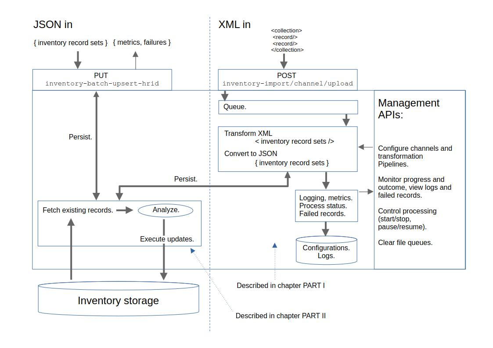

# mod-inventory-update

Copyright (C) 2019-2025 The Open Library Foundation

This software is distributed under the terms of the Apache License, Version 2.0. See the file "[LICENSE](LICENSE)" for
more information.

Mod-inventory-update (MIU) is a module for creating, updating and deleting instances, holdings records, and items in 
Inventory Storage, from XML or JSON sources files.

The module has two distinct sets of APIs. 

One is a group of import APIs, with which a client can configure, execute 
and monitor import jobs that transform and import collections of XML records of arbitrary format to Inventory Storage. 

The other is a handful of so called "upsert" APIs that a client can use to push JSON files of a predefined structure to MIU,
which will then insert or update instances, holdings records and items in Inventory Storage.

Depending on which of use these two use cases might be relevant, one can read different parts of this readme. 

If you have XML records for import, say, files with collections of MARC XML records, then you can read the paragraphs in 
[Import XML files](#import-xml-files) which will explain how to set up import channels with XSLT transformation pipelines. 
It is explained what data structure the MARC XML records must be transformed to in order to be imported to Inventory. To 
understand the specifics of how the module takes the transformed structure and imports it to Inventory, then you can read the paragraphs 
in [What the APIs do with the inventory record set](#what-the-apis-do-with-the-inventory-record-set). 

If you want to import JSON files, then you don't need the import channels or transformations. You can post the JSON directly 
to the upsert API. This is a synchronous operation with immediate feedback, as opposed to the XML import process, which 
is asynchronous. However, this requires the JSON to be compliant with the so-named "inventory record set" format up-front,
there is no transformation pipeline massaging the data into the inventory record sets needed for the module's CRUD engine. 
The schema for the JSON is documented in [upsert APIs, Open API specification](src/main/resources/openapi/inventory-update-5.0.yaml).
Again, to understand the specifics of how the module takes that JSON and imports it to Inventory, you can read the paragraphs
in [What the APIs do with the inventory record set](#what-the-apis-do-with-the-inventory-record-set).

<!-- TOC -->
* [mod-inventory-update](#mod-inventory-update)
  * [PART I. Import XML files](#part-i-import-xml-files)
    * [Create and manage channels](#create-and-manage-channels)
    * [The "import job" explained](#the-import-job-explained)
      * [HTTP requests for managing channels](#http-requests-for-managing-channels-)
      * [Request operating on multiple channels](#request-operating-on-multiple-channels)
      * [Error handling](#error-handling)
      * [Using `tag` for channel ID](#using-tag-for-channel-id)
    * [How to transform source XML to Inventory JSON.](#how-to-transform-source-xml-to-inventory-json)
  * [PART II. How MIU uses the inventory record set for updating Inventory Storage](#part-ii-how-miu-uses-the-inventory-record-set-for-updating-inventory-storage)
      * [Detect if holdings records or items should be deleted](#detect-if-holdings-records-or-items-should-be-deleted)
      * [Control record overlay on updates.](#control-record-overlay-on-updates)
        * [Prevent MIU from overriding existing values](#prevent-miu-from-overriding-existing-values)
        * [Instruct MIU to leave the item status unmodified under certain circumstance.](#instruct-miu-to-leave-the-item-status-unmodified-under-certain-circumstance)
        * [Instruct MIU to avoid deleting items even though they are missing from the input](#instruct-miu-to-avoid-deleting-items-even-though-they-are-missing-from-the-input)
        * [Retain omitted items if the status indicates that they are still circulating](#retain-omitted-items-if-the-status-indicates-that-they-are-still-circulating)
      * [Provisional Instance created when related Instance doesn't exist yet](#provisional-instance-created-when-related-instance-doesnt-exist-yet)
      * [Deletion of Instance-to-Instance relations](#deletion-of-instance-to-instance-relations)
      * [Instance DELETE requests](#instance-delete-requests)
        * [Protecting certain items or holdings records from deletion in DELETE requests](#protecting-certain-items-or-holdings-records-from-deletion-in-delete-requests)
      * [Statistical coding of delete protection events](#statistical-coding-of-delete-protection-events)
    * [Additional info about the batch version of upserts `/inventory-batch-upsert-hrid`](#additional-info-about-the-batch-version-of-upserts-inventory-batch-upsert-hrid)
  * [Miscellaneous](#miscellaneous)
    * [`/shared-inventory-upsert-matchkey`](#shared-inventory-upsert-matchkey)
    * [APIs for fetching an Inventory record set](#apis-for-fetching-an-inventory-record-set)
      * [Fetching an Inventory record set from `inventory-upsert-hrid/fetch`](#fetching-an-inventory-record-set-from-inventory-upsert-hridfetch)
      * [The _version fields and optimistic locking](#the-_version-fields-and-optimistic-locking)
  * [Prerequisites](#prerequisites)
  * [Building](#building)
  * [Additional information](#additional-information)
    * [Other documentation](#other-documentation)
    * [Code of Conduct](#code-of-conduct)
    * [Issue tracker](#issue-tracker)
    * [ModuleDescriptor](#moduledescriptor)
    * [API documentation](#api-documentation)
    * [Code analysis](#code-analysis)
    * [Download and configuration](#download-and-configuration)
<!-- TOC -->

## PART I. How to import XML files

The importing component of MIU consists of so-called import "channels". Each channel has a file queue that source files can 
be uploaded to, and a processing pipeline that can perform the importing of source files from the queue to inventory storage.

The channel design is meant to allow for multiple input formats, for example, potentially, binary MARC or JSON files. However, 
the current pipeline implementation supports XML source files. 

To use the XML importing API, the channels must be configured with a transformation pipeline. The transformation pipeline
is a chain of zero or more XSLT transformation steps that will restructure XML records of arbitrary format into "inventory 
record sets" suitable for running updates on instances, holdings and item. The pipeline can be created using the provided
configuration APIs.

The main elements of the importing component are thus

- a channel with an associated file queue
- a processing pipeline, called a "transformation"
- the "transformation"  has an ordered set of "transformation steps" with XSLT style-sheets, where the last step will be a  generic (system supplied) crosswalk of the XML to JSON.
- the outcome of this process is sent to CRUD component that will batch and persist the results to inventory storage.

See the OpenAPI spec for further details [XML importing APIs](src/main/resources/openapi/inventory-import-1.0.yaml).

### Create and manage channels

The configurable parts of the channel itself are

- A name for the channel.
- A shorthand tag for the channel that can be used instead of its UUID in certain API requests.  
- A reference to the "transformation" that processes the incoming source files.
- Two boolean state properties for marking the channel 'enabled' and 'listening'
  - `enabled` means that a background process is running (or should be running) for the channel, and that it has a file queue to which it is possible to upload files.
  - `listening` means that the channel, if enabled, will actively pick up files, if any, from the queue and process/import them.

Finally, there is a derived, non-persistent (read only) property named `commissioned` that indicates if an enabled channel actually has a running process. A channel will 
automatically get a background process when it is marked `enabled` but if the module gets shut down it will not have that process once the module is brought up again. In that 
scenario the channel will be `enabled` but not `commissioned`, and would have to be re-commissioned to give it an active process. 
An enabled channel can be recommissioned implicitly by uploading a new file to it, or explicitly by issuing a 
commission request to the channel. 

The dynamic parts of an enabled channel are

- A dedicated process (a worker verticle in Vert.x terms). If the channel is marked `listening` this process will actively pick up files from the file queue.
- A file queue: a set of filesystem directories that acts as a queue for incoming files, ensuring that they are processed in order.
- `importJob`:  if there are any incoming files, and the channel is actively listening, it will create a record of an "import job" 
  with `logLines`, and `failedRecords` if any.
- When the last file in the queue is processed, the import job will be marked at finish on the `importJob` record. The channel will keep listening for new files and create new `importJob` if any appear.

### The "import job" explained

An "import job" is basically just a demarcation of processing logs. The `importJob` is a record that logs the start and finish time of the processing of a continuous set of queued import files. 
The `importJob` is created when a channel with an empty queue receives a new source file, and it is marked finished when the file queue is once again empty. Attached to the `importJob`
are records containing information about the number of records processed with some performance statistics, for each file and for the job as a whole. If any records encountered errors when attempting 
to import them in Inventory, error report records named `failedRecord` will likewise be attached to the `importJob`. In other words, the `importJob` organises the 
counting of records processed and groups failed records.

#### HTTP requests for managing channels 

| API                                                         | Parameter         | Feature                                                                                                                                                                                                                                                                                                                                                                                                                                                                                                                                                                                                                                                                                                                              |
|-------------------------------------------------------------|-------------------|--------------------------------------------------------------------------------------------------------------------------------------------------------------------------------------------------------------------------------------------------------------------------------------------------------------------------------------------------------------------------------------------------------------------------------------------------------------------------------------------------------------------------------------------------------------------------------------------------------------------------------------------------------------------------------------------------------------------------------------|
| POST `/inventory-import/channels`                           |                   | Create a channel                                                                                                                                                                                                                                                                                                                                                                                                                                                                                                                                                                                                                                                                                                                     |
| PUT `/inventory-import/channels/<channel uuid>`             |                   | Update properties of a channel. <br/>If the channel was disabled before, and `enabled` is then set to true, a channel process will be launched, a new file system queue will be created, and the channel will allow uploading of files to it.<br/>If the channel was enabled, setting `enabled` to false, will stop the channel process, remove the file queue and prevent upload of files to the queue.<br/>If `listening` is being set to `true` the (enabled, unpaused) channel will pick up any current of future files from the queue and import them to Inventory.<br/> If `listening` is being set to false, the (enabled) channel will still allow uploading of files to the queue but will not pick them up for processing. |
| POST `/inventory-import/channels/<channel id>/commission`   | `retainQueue`     | Launch a channel process, create a filesystem queue, allow uploads, and mark the channel enabled. <br/>The command takes the parameter `?retainQueue`=[true,false] (default `false`). When `true`, any filesystem queue that was left behind from a previous channel process will be kept.<br/>If not setting the parameter `retainQueue` to `true`, this command has the same effect as PUTting a channel object with the property `enabled` set to `true`.                                                                                                                                                                                                                                                                         |
| POST `/inventory-import/channels/<channel id>/decommission` | `retainQueue`     | Stop the channel process, remove the file system queue, prevent uploads, and mark the channel disabled. <br/>The command takes the parameter `?retainQueue`=[true,false] (default `false`). When set to `true`, the file system queue for this channel is kept and potentially available if the channel process is launched again. <br/>Unless the parameter `retainQueue` is set to `true`, this command has the same effect as PUTting a channel object with the property `enabled` set to `false`.                                                                                                                                                                                                                                |
| POST `/inventory-import/channels/<channel id>/listen`       |                   | Listen for source files in queue, same effect as setting `channel.listening`=`true`                                                                                                                                                                                                                                                                                                                                                                                                                                                                                                                                                                                                                                                  |
| POST `/inventory-import/channels/<channel id>/no-listen`    |                   | Ignore source files in queue, same effect as setting `channel.listening`=`false`                                                                                                                                                                                                                                                                                                                                                                                                                                                                                                                                                                                                                                                     |
| POST `/inventory-import/channels/<channel id>/init-queue`   |                   | Delete all the source files in a queue (or re-establish an empty queue structure, in case the previous queue was deleted directly in the file system for example).                                                                                                                                                                                                                                                                                                                                                                                                                                                                                                                                                                   |
| DELETE `/inventory-import/channels/<channel uuid>`          |                   | Delete the channel configuration, including the file queue but not the channel's job history                                                                                                                                                                                                                                                                                                                                                                                                                                                                                                                                                                                                                                         |
| POST `/inventory-import/channels/<channel id>/upload`       | `filename`        | Push a source file to the channel, currently set to accept files up to a size of 100 MB                                                                                                                                                                                                                                                                                                                                                                                                                                                                                                                                                                                                                                              |
| POST `/inventory-import/channels/<channel id>/pause-job`    |                   | Halt processing in order to potentially resume it again with processing logs assigned to the same job                                                                                                                                                                                                                                                                                                                                                                                                                                                                                                                                                                                                                                |
| POST `/inventory-import/channels/<channel id>/resume-job`   | `skipCurrentFile` | Resume a paused job, counting subsequent files in the queue with the existing import job                                                                                                                                                                                                                                                                                                                                                                                                                                                                                                                                                                                                                                             |


#### Request operating on multiple channels

| API                                                    | Parameter    | Feature                                                                                                                                                                                                                                                                                                                                                                                                                                                                                                                                                                                                                                                                            |
|--------------------------------------------------------|--------------|------------------------------------------------------------------------------------------------------------------------------------------------------------------------------------------------------------------------------------------------------------------------------------------------------------------------------------------------------------------------------------------------------------------------------------------------------------------------------------------------------------------------------------------------------------------------------------------------------------------------------------------------------------------------------------|
| POST `/inventory-import/recover-interrupted-channels`  | `listening`  | Deploy ("commission") all channels that are marked `enabled` but are not actually running. This is a scenario that would presumably only occur if the module was restarted while channels were enabled. The command takes a paramter `?listening=false` to enable the channels but not start actual importing right away. <br/> Notice that when posting a source file to a channel that is `enabled` but not deployed (not "commissioned") then the channel will be implicitly commissioned by that post. Explicitly recovering channels by this command is merely to ensure completion of already existing file queues for which processing was interrupted by a module restart. |


#### Error handling

If a fatal error occurs while a job is running, the module will attempt to gracefully pause the processing. The import job will be 
marked paused so that processing can potentially be resumed with processing statistics and failed records counting towards the same import job. 

There are two main categories of errors that should halt the processing. One would be a fatal problem with the import 
file itself, for example that it contains invalid XML and thus cannot be meaningfully processed. 
The other would be some external problem like losing the access to Inventory Storage. In the first case it will not help
to resume the job from the bad file, since it will immediately get halted again. There is therefore an option to skip the 
current file when resuming. In the second case, the file is fine, and if the external problem can be fixed, the job should 
be resumed from the same file. 

  Note on possible enhancements
   - Resume from a given record in the file? Currently, the entire file will be resumed, but a number of records of the 
     file may already have been imported alright, for example all records up until the point of a bad XML construct. 
     Usually it does not hurt to repeat upserts, the end result will be the same, but processing counts will be affected in ways that might make them look a bit off.
   - Replace current file?  Currently, one can opt to skip current file if it is invalid. However, it might be desired to 
     have an option to correct the file locally and upload it again in place of the current file as opposed to simply 
     have it uploaded to the end of the file queue. This would be to ensure order of processing if important.

#### Using `tag` for channel ID

The <channel id> in the paths can either be the UUID of the channel record (`channel.id`) or the value of the property
`channel.tag`. The tag is an optional, unique, max 24 character long string without spaces. If it's set on a channel,
that channel can be referenced by the tag in the various channel commands. The basic REST requests (GET, PUT, DELETE channel)
use the UUID like standard FOLIO APIs.


### How to transform source XML to Inventory JSON.

Mod-inventory-update operates with a specific JSON schema called an "inventory record set" (IRS). The IRS is a 
composite object containing Inventory records like instances, holdings and items, as well as different kinds of 
instance-to-instance relationships. Processing instructions for MIU can be attached to the record set. 

This format appears in two different contexts in MIU. Both are displayed in the drawing below.

When using MIU's JSON based "upsert" APIs, the composite inventory record set is the JSON schema than incoming JSON files must comply with.

When using MIU's XML import APIs, the IRS is an intermediate, internal exchange format. Incoming XML records can be of an arbitrary structure
(as long as they are <record>s) but they must be transformed to the IRS structure for MIU to populate inventory storage with the data. 
Thus it is necessary to know the format of the composite record set when creating the transformation style sheets. The transformation must
create the XML equivalent of the IRS, which MIU will then generically transform to the JSON version of the IRS.

The JSON based upsert APIs are synchronous, processing the input and returning a response right away, once done.
The XML based import APIs on the other hand work asynchronously, and will put the file in queue and return a response that
this has been done. But feedback regarding the processing and its outcomes is logged in the module, to be retrieved later
through the APIs.



The high level structure of an inventory record set is
```
 - Inventory instance {hrid and other properties}
 - holdings records (optional)
   - Inventory holdings record {hrid and other properties}
     - items (optional)
       - Inventory item {hrid and other properties}
       - item
       - ...
   - Holdings record
     - items
       - item
       - item
       - ...
   - ...
 - instance relations (optional)
 - processing (optional)
```

The details of this structure are described below. See also the OpenAPI spec for more details:
[Upsert APIs](src/main/resources/openapi/inventory-update-5.0.yaml).


## PART II. How MIU uses an inventory record set JSON for updating Inventory Storage

This part explains how MIU uses the inventory record set JSON to control and perform the persistence of instances, holdings records 
and items in Inventory Storage. 

When using the synchronous, JSON based upsert APIs of MIU, this walkthrough explains what happens when the client pushes a
valid inventory record set JSON to MIU. 

Even for a client uploading XML files to MIU, this part applies. The outcome of the XSLT transformation described 
in PART I will (must) likewise be a valid inventory record set, which will go through the same processing as if it was 
pushed to the upsert API directly.  

#### All updates to Inventory are HRID based

The upsert APIs will update an Instance as well as its associated holdings and items based on incoming HRIDs on all three record types. If
an instance with the incoming HRID does not exist in storage already, the new Instance is inserted, otherwise the
existing instance is updated - thus the term 'upsert'.

This means that HRIDs are required to be present in records from the client for all three record types. As a consequence, these client side 
identifiers must furthermore be consistent over time. MIU will not be able to find existing records in Inventory, and update them accordingly, if the 
identifiers are changed on the client side. Whenever new identifiers occur in a feed, MIU will treat them as new records to 
be created, rather than updated, in Inventory.

#### Detect if holdings records or items should be deleted

The API will detect if holdings and/or items have disappeared from the Instance since last update and in that case
remove them from storage. Note, however, that there is a distinction between a request with no `holdingsRecords`
property and a request with an empty `holdingsRecords` property. If existing holdings and items should not be touched,
for example if holdings and items are maintained manually in Inventory, then no `holdingsRecords` property should appear
in the request JSON and existing records would be ignored. Providing an empty `holdingsRecords` property, on the other
hand, would cause all existing holdings and items to be deleted. The API will also detect if new holdings or items on
the Instance existed already on a different Instance in storage and then move them over to the incoming Instance. The
IDs (UUIDs) on any pre-existing Instances, holdings records and items will be preserved in this process, thus avoiding
breaking any external UUID based references to these records.

The Inventory Record Set, that is PUT to the end point, may contain relations to other Instances, for example the kind
of relationships that tie multipart monographs together or relations pointing to preceding or succeeding titles. Based
on a comparison with the set of relationships that may be registered for the Instance in storage already, relationships
will be created and/or deleted (updating relationships is obsolete).

#### Control record overlay on updates.

The default behaviour of MIU is to simply replace the entire record on updates, for example override the entire
holdingsRecord, with the input JSON it receives from the client, except for the ID (UUID) and version.

The default behaviour can be changed per request using structures
in the processing element.

##### Prevent MIU from overriding existing values

MIU can be instructed to leave certain properties in place when updating Instances, holdings records, and Items.

For example, to retain all existing Item properties that are not included in the request body to MIU, use
the `retainExistingValues`.

```
"processing": {
   "item": {
     "retainExistingValues": {
       "forOmittedProperties": true
     }
   }
}
```

This is a way to have MIU only update the set of properties it should be concerned with and let other properties be the
responsibility of other processes if required.

If MIU sets certain properties on insert but should not touch them in subsequent updates -- even though they are
provided in the request body to MIU -- those properties can be explicitly turned off in updates:

```
"processing": {
   "item": {
     "retainExistingValues": {
       "forTheseProperties": [ "a", "b", "c" ]
     }
   }
}
```

The two settings can be combined to not touch neither omitted properties nor the explicitly listed properties.

If `forOmittedProperties` is used, it requires the client to distinguish between sending an empty property vs not sending
the property at all. Say, an Instance had `contributors` before, but now they were removed in the source catalogue. If this
is communicated to MIU by an empty `contributors` property, then it's fine, it will become empty in Inventory Storage
too, but if the property is simply removed from the request body altogether, then the existing value of `contributors`
will be retained in storage if `forOmittedProperties` is set to true.

##### Instruct MIU to leave the item status unmodified under certain circumstance.

In case the Item status is being managed outside the MIU update process, likely by FOLIO Circulation, MIU can be
instructed to only touch the status under certain circumstances.

For example, to only overwrite a status of "On order" and retain any other statuses, do:

```
processing": {
   "item": {
     "status": {
       "policy": "overwrite",
       "ifStatusWas": [
         {"name": "On order"}
       ]
     }
   }
}
```

The default behaviour is to overwrite all statuses.

##### Instruct MIU to avoid deleting items even though they are missing from the input

When MIU receives an Instance update, it will look for existing items on the holdings record that are not present in the
update and then delete them.

With this instruction, deletion can be prevented based on a regular expression matched against a specified property.
This could be used to preserve items created from other sources, provided that a regular expression can be written that
will identify such items
without at the same time matching items of the current data feed.

For example, to retain items that have HRIDs starting with non-digit characters:

```
processing": {
   "item": {
     "retainOmittedRecord": {
       "ifField": "hrid",
       "matchesPattern": "\\D+.*"
     }
   }
}
```

##### Retain omitted items if the status indicates that they are still circulating

Usually items that are omitted from the holdings record in the upsert will be removed from storage by MIU. The
exceptions are if they are delete protected as described in the previous section, or if they have a status that
indicates they might still be circulating.

MIU will avoid deleting items with following item statuses

* Awaiting delivery
* Awaiting pickup
* Checked out
* Aged to lost
* Claimed returned
* Declared lost
* Paged
* In transit

#### Provisional Instance created when related Instance doesn't exist yet

If an upsert request comes in with a relation to an Instance that doesn't already exist in storage, a provisional
Instance will be created provided that the request contains sufficient data as required for creating the provisional
Instance - like any mandatory Instance properties.

#### Deletion of Instance-to-Instance relations

Only existing relationships that are explicitly omitted in the request will be deleted. In FOLIO Inventory, a relation
will appear on both Instances of the relation, say, one Instance will have a parent relation, and the other will have a
child relation.

This may not be the case in the source system where, perhaps, the child record may declare its parent, but the parent
will not mention its child records.

To support deletion of relations for these scenarios, and not implicitly but unintentionally delete too many, following
rules apply:

Including an empty array of child instances will tell the API that if the Instance has any existing child relations,
they should be deleted.

```
"instanceRelations": {
  "childInstances": []
}
```

Leaving out any reference to child instances -- or as in this sample, any references to any related Instances at all --
means that any existing relationships will be left untouched by the update request.

```
"instanceRelations": {
}
```

#### Instance DELETE requests

The API supports DELETE requests, which would delete the Instance with all of its associated holdings records and items
and any relations it might have to other Instances.

To delete an instance record with all its holdings and items, send a DELETE request to `/inventory-upsert-hrid` with a payload like this:

```
{
  "hrid": "001"
}
```

Note that deleting any relations that the Instance had to other instances only cuts those links between them but does not otherwise affect those other instances.

##### Protecting certain items or holdings records from deletion in DELETE requests

Delete requests can be extended with a processing instruction that blocks deletion of holdings and/or items based on
pattern matching in select properties.

This can be used to avoid deletion of items that are created outside the MIU pipeline (for example through the
Inventory UI) provided that there is a pattern that can be applied to a property value of those records to identify
which items to protect.

For example, to protect items that have HRIDs starting with non-digit characters, following delete body for deletion of
the Instance with HRID "123456" could be used:

```
{
    "hrid":  "1234567",
    "processing": {
       "item": {
         "blockDeletion": {
           "ifField": "hrid",
           "matchesPattern": "\\D+.*"
         }
       }
    }
}
```

When a delete request is sent for an Instance that has protected Items, the deletion of the Instance, as well as the
holdings record for the Item, will be blocked as well. Other holdings records or Items that do not match the block
criteria will be deleted.

Deletion will likewise be blocked when one or more items under the instance have one of the statuses also listed in
"Retain omitted items if the status indicates that they are still circulating":

* Awaiting delivery
* Awaiting pickup
* Checked out
* Aged to lost
* Claimed returned
* Declared lost
* Paged
* In transit

#### Statistical coding of delete protection events

When records are prevented from being deleted, the delete or the upsert request can be configured to set specified
statistical codes on the record, which was up for deletion, and then update the existing record with those. This will not
count as a record update, and if the update fails -- for example due to use of invalid UUIDs -- it will write an error
to the module log but will not fail the overall request. If non-existing statistical codes are specified the storage
module will silently avoid setting them.

Here are some examples of statistical coding of skipped deletes, first in a delete requests

Set all available codes on all record types. This means not just setting the code on the item that was not delete but also marking it on the instance that consequently could also not be deleted:
```
{
  "hrid": "in001",
  "processing": {
    "item": {
      "blockDeletion": {
        "ifField": "hrid",
        "matchesPattern": "it.*"
      },
      "statisticalCoding": [
        {"if": "deleteSkipped", "becauseOf":  "ITEM_STATUS", "setCode": "1ce0a775-286f-45ae-8446-e26ba0687b61"},
        {"if": "deleteSkipped", "becauseOf":  "ITEM_PATTERN_MATCH", "setCode": "42b735fa-eb6f-4c53-b5d5-2d98500868c5"}
      ]
    },
    "holdingsRecord": {
      "blockDeletion": {
        "ifField": "hrid",
        "matchesPattern": "ho.*"
      },
      "statisticalCoding": [
        {"if": "deleteSkipped", "becauseOf":  "HOLDINGS_RECORD_PATTERN_MATCH", "setCode": "d11fd9d8-b234-4159-b7b1-61b531bb1405"},
        {"if": "deleteSkipped", "becauseOf":  "ITEM_STATUS", "setCode": "1ce0a775-286f-45ae-8446-e26ba0687b61"},
        {"if": "deleteSkipped", "becauseOf":  "ITEM_PATTERN_MATCH", "setCode": "42b735fa-eb6f-4c53-b5d5-2d98500868c5"}
      ]
    },
    "instance": {
      "statisticalCoding": [
        {"if": "deleteSkipped", "becauseOf":  "PO_LINE_REFERENCE", "setCode": "98993c92-c5c9-414b-b12c-a82836b0dbf6"},
        {"if": "deleteSkipped", "becauseOf":  "HOLDINGS_RECORD_PATTERN_MATCH", "setCode": "d11fd9d8-b234-4159-b7b1-61b531bb1405"},
        {"if": "deleteSkipped", "becauseOf":  "ITEM_STATUS", "setCode": "1ce0a775-286f-45ae-8446-e26ba0687b61"},
        {"if": "deleteSkipped", "becauseOf":  "ITEM_PATTERN_MATCH", "setCode": "42b735fa-eb6f-4c53-b5d5-2d98500868c5"}
      ]
    }
  }
}
```

Lift all codes up on the instance level, even if the primarily protected record was a holdings record or an item:

```
{
  "hrid": "in001",
  "processing": {
    "item": {
      "blockDeletion": {
        "ifField": "hrid",
        "matchesPattern": "it.*"
      }
    },
    "holdingsRecord": {
      "blockDeletion": {
        "ifField": "hrid",
        "matchesPattern": "ho.*"
      }
    },
    "instance": {
      "statisticalCoding": [
        {"if":  "deleteSkipped", "becauseOf":  "PO_LINE_REFERENCE", "setCode": "98993c92-c5c9-414b-b12c-a82836b0dbf6"},
        {"if":  "deleteSkipped", "becauseOf":  "HOLDINGS_RECORD_PATTERN_MATCH", "setCode": "d11fd9d8-b234-4159-b7b1-61b531bb1405"},
        {"if":  "deleteSkipped", "becauseOf":  "ITEM_STATUS", "setCode": "1ce0a775-286f-45ae-8446-e26ba0687b61"},
        {"if":  "deleteSkipped", "becauseOf":  "ITEM_PATTERN_MATCH", "setCode": "42b735fa-eb6f-4c53-b5d5-2d98500868c5"}
      ]
    }
  }
}
```

Only set the code on the record that was directly protected from deletion (not on the indirectly delete protected records) :

```
{
  "hrid": "in001",
  "processing": {
    "item": {
      "blockDeletion": {
        "ifField": "hrid",
        "matchesPattern": "it.*"
      },
      "statisticalCoding": [
        {"if": "deleteSkipped", "becauseOf": "ITEM_STATUS", "setCode": "1ce0a775-286f-45ae-8446-e26ba0687b61"},
        {"if": "deleteSkipped", "becauseOf": "ITEM_PATTERN_MATCH", "setCode": "42b735fa-eb6f-4c53-b5d5-2d98500868c5"}
      ]
    },
    "holdingsRecord": {
      "blockDeletion": {
        "ifField": "hrid",
        "matchesPattern": "ho.*"
      },
      "statisticalCoding": [
        {"if": "deleteSkipped", "becauseOf": "HOLDINGS_RECORD_PATTERN_MATCH", "setCode": "d11fd9d8-b234-4159-b7b1-61b531bb1405"}
      ]
    },
    "instance": {
      "statisticalCoding": [
        {"if": "deleteSkipped", "becauseOf": "PO_LINE_REFERENCE", "setCode": "98993c92-c5c9-414b-b12c-a82836b0dbf6"}
      ]
    }
  }
}
```

Statistical codes can be set on holdings and items in upserts (deleting the instance is not an option in the upsert,
and preventing delete due to PO_LINE_REFERENCE does not apply).

For example:
```
"processing": {
  "item": {
    "retainOmittedRecord": {
      "ifField": "hrid",
      "matchesPattern": "it.*"
    },
    "statisticalCoding": [
      { "if": "deleteSkipped", "becauseOf": "ITEM_STATUS", "setCode": "2b750461-5368-4a4e-9484-4e1eea2bc384" },
      { "if": "deleteSkipped", "becauseOf": "ITEM_PATTERN_MATCH", "setCode": "6f143d4c-75fe-4987-ae3e-3d7c2a4ccca2" },
    ]
  },
  "holdingsRecord": {
    "retainOmittedRecord": {
      "ifField": "hrid",
      "matchesPattern": "ho.*"
    }
    "statisticalCoding": [
      { "if": "deleteSkipped", "becauseOf": "ITEM_STATUS", "setCode": "b2452cc2-7024-41fa-a5c7-b1736280d781" },
      { "if": "deleteSkipped", "becauseOf": "ITEM_PATTERN_MATCH", "setCode": "a8e70d5e-2861-4a89-93cc-88679c74e592" },
      { "if": "deleteSkipped", "becauseOf": "HOLDINGS_RECORD_PATTERN_MATCH", "setCode": "e24f4a4e-8d8f-4ca2-ab05-dd497a8379e3" }
    ]
  },
  "instance": {
  }
}
```

### Additional info about the batch version of upserts `/inventory-batch-upsert-hrid`

A client can send arrays of inventory record sets to the batch APIs with significant improvement to overall throughput
compared to the single record APIs.

These APIs utilise Inventory Storage's batch upsert APIs for Instances, holdings records and Items.

In case of data problems in either type of entity (referential constraint errors, missing mandatory properties, etc),
the entire batch of the given entity will fail. For example if an Item fails all Items fail. At this point all the
Instances and holdings records are presumably persisted. The module aims to recover from such inconsistent states by
switching from batch processing to record-by-record updates in case of errors so that, in this example, all the good
Items can be persisted. The response on a request with one or more errors, that didn't prevent the entire request from being processed, will be
a `207` `Multi-Status`, and the one or more error that were found will be returned with the
response JSON, together with the summarised update statistics ("metrics).

In a feed with many errors the throughput will be close to that of the single record APIs since many batches will be
processed record-by-record.

If the client needs to pair up error reports in the response with any original records it holds itself, the client can
set an identifier in the inventory record set property "processing". The name and content of that property is entirely
up to the client, MIU will simply return the data it gets, so it could be a simple sequence number for the
batch, like

```
{
 "inventoryRecordSets":
  [
   {
    "instances": ...
    "holdingsRecords": ...
    "processing": {
      ...
      "batchIndex": 1
    }
   },
    "instances": ...
    "holdingsRecords": ...
    "processing": {
      ...
      "batchIndex": 2
    }
}
```

A response of a batch upsert of 100 Instances where the 50th failed, the error message is tagged with the clients batch
index.

```
{
    "metrics": {
        "INSTANCE": {
            "CREATE": {
                "COMPLETED": 99,
                "FAILED": 1,
                "SKIPPED": 0,
                "PENDING": 0
            },
            "UPDATE": {
                "COMPLETED": 0,
                "FAILED": 0,
                "SKIPPED": 0,
                "PENDING": 0
            },
            "DELETE": {
                "COMPLETED": 0,
                "FAILED": 0,
                "SKIPPED": 0,
                "PENDING": 0
            }
        },
        "HOLDINGS_RECORD": {
            "CREATE": {
                "COMPLETED": 0,
                "FAILED": 0,
                "SKIPPED": 0,
                "PENDING": 0
            },
            "UPDATE": {
                "COMPLETED": 0,
                "FAILED": 0,
                "SKIPPED": 0,
                "PENDING": 0
            },
            "DELETE": {
                "COMPLETED": 0,
                "FAILED": 0,
                "SKIPPED": 0,
                "PENDING": 0
            }
        },
        "ITEM": {
            "CREATE": {
                "COMPLETED": 0,
                ...
                ...
                ...
            }
        }
    },
    "errors": [
        {
            "category": "STORAGE",
            "message": {
                "message": {
                    "errors": [
                        {
                            "message": "must not be null",
                            "type": "1",
                            "code": "javax.validation.constraints.NotNull.message",
                            "parameters": [
                                {
                                    "key": "source",
                                    "value": "null"
                                }
                            ]
                        }
                    ]
                }
            },
            "shortMessage": "One or more errors occurred updating Inventory records",
            "entityType": "INSTANCE",
            "entity": {
                "title": "New title 50",
                "instanceTypeId": "12345",
                "matchKey": "new_title_50__________________________________________________________0000_____________________________________________________________________________________________p",
                "id": "782d5015-147d-433d-beaf-06a47bde6be5"
            },
            "statusCode": 422,
            "requestJson": {
                "instance": {
                    "title": "New title 50",
                    "instanceTypeId": "12345",
                    "matchKey": "new_title_50__________________________________________________________0000_____________________________________________________________________________________________p"
                },
                "processing": {
                    "batchIndex": 50
                }
            },
            "details": {

            }
        }
    ]
}
```

Note that any given batch cannot touch the same records twice, since that would require a certain order of processing,
something that batching will not be able to guarantee. For the upsert by HRID for example, if any HRID appears twice in
the
batch, the module will fall back to record-by-record updates and process the record sets in the order it receives them.
Same
for the upsert by match-key, if any match-key appears twice in the batch.


## Miscellaneous

### `/shared-inventory-upsert-matchkey`

Currently obsolete.

Inserts or updates an Instance based on whether an Instance with the same matchKey exists in storage already. The
matchKey is typically generated from a combination of metadata in the bibliographic record, and the API has logic for
that, but if an Instance comes in with a ready-made `matchKey`, the end-point will use that instead.

### APIs for fetching an Inventory record set

There are two REST paths for retrieving single Inventory record sets by ID: `/inventory-upsert-hrid/fetch/{id}`
and `/shared-inventory-upsert-matchkey/fetch/{id}`. Both APIs will return a record set with an Instance record,
potentially an array of holdings records, each holdings-record potentially with an array of Item records, and finally a
set of arrays of external relations that the Instance has with other Instances.

#### Fetching an Inventory record set from `inventory-upsert-hrid/fetch`

The ID provided on the API path is the Instance HRID. A request like
`GET /inventory-upsert-hrid/fetch/inst000000000017` would give a response like this (shortened):

```
{
  "instance" : {
    "_version" : 1,
    "hrid" : "inst000000000017",
    "source" : "FOLIO",
    "title" : "Interesting Times",
    "identifiers" : [ {
      "value" : "0552142352",
      "identifierTypeId" : "8261054f-be78-422d-bd51-4ed9f33c3422"
    } ],
    "contributors" : [ {
      "name" : "Pratchett, Terry",
      "contributorNameTypeId" : "2b94c631-fca9-4892-a730-03ee529ffe2a"
    } ],
    "subjects" : [ ],
    ... etc
    "statusUpdatedDate" : "2021-11-01T23:31:36.026+0100",
    "metadata" : {
      "createdDate" : "2021-11-01T22:31:36.025+00:00",
      "updatedDate" : "2021-11-01T22:31:36.025+00:00"
    },
  },
  "holdingsRecords" : [ {
    "_version" : 1,
    "hrid" : "hold000000000007",
    "permanentLocationId" : "f34d27c6-a8eb-461b-acd6-5dea81771e70",
    ... etc
    "metadata" : {
      "createdDate" : "2021-11-01T22:31:38.030+00:00",
      "updatedDate" : "2021-11-01T22:31:38.030+00:00"
    },
    "items" : [ {
      "_version" : 1,
      "hrid" : "item000000000012",
      "barcode" : "326547658598",
      ... etc
      "status" : {
        "name" : "Checked out",
        "date" : "2021-11-01T22:31:38.587+00:00"
      },
      "materialTypeId" : "1a54b431-2e4f-452d-9cae-9cee66c9a892",
      "metadata" : {
        "createdDate" : "2021-11-01T22:31:38.587+00:00",
        "updatedDate" : "2021-11-01T22:31:38.587+00:00"
      }
    } ]
  } ],
  "instanceRelations" : {
    "parentInstances" : [ ],
    "childInstances" : [ ],
    "precedingTitles" : [ ],
    "succeedingTitles" : [ ]
  }
}
(Note: it's possible to use the Instance UUID instead of the HRID in the GET request)
```

It's possible to take the response from the `/inventory-upsert-hrid/fetch` and PUT it back to
the `/inventory-upsert-hrid` API.

There may not be obvious use cases for it but for what it's worth, the response JSON can be edited by, say, setting
"editions" to ["First edition"] or adding one more Item, and the record set JSON can then be PUT back
to `/inventory-upsert-hrid` to perform the updates.

The response JSON above contains none of the primary key fields, `id`, or referential fields,
`instanceId` and `holdingsRecordId`, for the three main entities of the Inventory record set. This is because the
`inventory-upsert-hrid` API is entirely HRID based (at least when viewed from the outside. Internally the module of
course deals with the UUIDs).

The client of the API is responsible for knowing what the HRIDs for the records are and for ensuring that the
provided IDs are indeed unique.

#### The _version fields and optimistic locking

The `_version` fields for optimistic locking can be seen in the output above. These values would have no effect in a PUT
to the upsert API. As the service receives the record set JSON in a PUT request, it will pull new versions of the
entities from storage and get the latest version numbers from that anyway.

       | 2.2.0                          |

## Prerequisites

- Java 21 JDK
- Maven 3.3.9

## Building

run `mvn install` from the root directory.

## Additional information

### Other documentation

Other [modules](https://dev.folio.org/source-code/#server-side) are described, with further FOLIO Developer
documentation at [dev.folio.org](https://dev.folio.org/)

### Code of Conduct

Refer to the Wiki [FOLIO Code of Conduct](https://wiki.folio.org/display/COMMUNITY/FOLIO+Code+of+Conduct).

### Issue tracker

See project [MODINVUP](https://issues.folio.org/browse/MODINVUP)
at the [FOLIO issue tracker](https://dev.folio.org/guidelines/issue-tracker).

### ModuleDescriptor

See the [ModuleDescriptor](descriptors/ModuleDescriptor-template.json)
for the interfaces that this module requires and provides, the permissions, and the additional module metadata.

### API documentation

* [Updating (OpenAPI)](src/main/resources/openapi/inventory-update-5.0.yaml)
* [Importing (OpenAPI)](src/main/resources/openapi/inventory-import-1.0.yaml)

Generated [API documentation](https://dev.folio.org/reference/api/#mod-inventory-update).

### Code analysis

[SonarQube analysis](https://sonarcloud.io/dashboard?id=org.folio%3Amod-inventory-update).

### Download and configuration

The built artefacts for this module are available. See [configuration](https://dev.folio.org/download/artifacts) for
repository access, and the [Docker image](https://hub.docker.com/r/folioorg/mod-inventory-update/).

